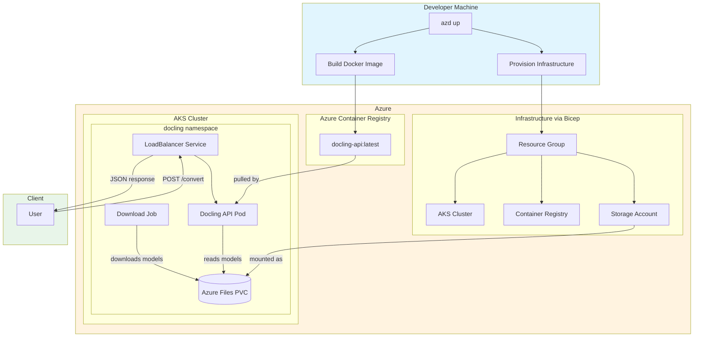
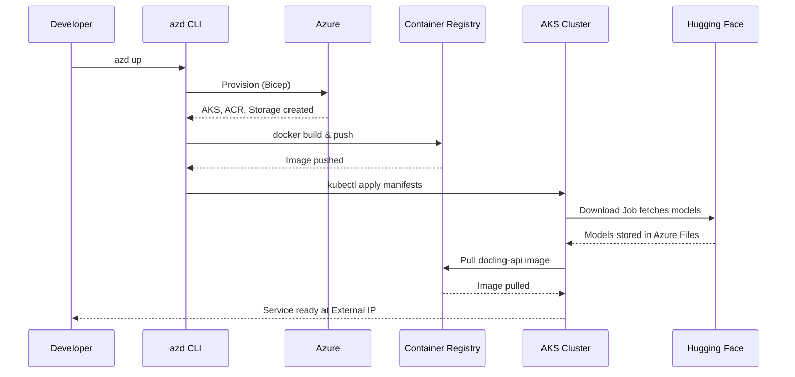

# Deploying Hugging Face model using Xet to download and deploy on AKS

[HF link](https://huggingface.co/docling-project/docling-models)

## Docling on AKS

Deploy [Docling](https://github.com/DS4SD/docling) document processing API on Azure Kubernetes Service (AKS) with pre-downloaded models from Hugging Face stored on Azure Files.

## What is Docling?

Docling is a document processing library that converts PDFs and other documents into structured formats. It uses ML models for:
- **Layout analysis** - Detecting document structure (headers, paragraphs, tables)
- **Table extraction** - Understanding table structure and cell relationships
- **OCR** - Optional text recognition for scanned documents

## Architecture



### Deployment Flow



## Project Structure

```
aks-hf-xet/
├── azure.yaml              # Azure Developer CLI config
├── infra/                  # Infrastructure (Bicep)
│   ├── main.bicep          # Main template
│   └── modules/
│       ├── aks.bicep       # AKS cluster (with OIDC & workload identity)
│       ├── acr.bicep       # Container Registry
│       ├── storage.bicep   # Storage account
│       ├── aks-acr-role.bicep    # AKS → ACR pull permissions
│       └── aks-storage-role.bicep # AKS → Storage managed identity permissions
├── k8s/                    # Kubernetes manifests
│   ├── namespace.yaml
│   ├── storage.yaml        # PV/PVC for Azure Files (managed identity)
│   ├── download-job.yaml   # Model download job
│   └── deployment.yaml     # API deployment + service
├── scripts/
│   ├── deploy.ps1          # Windows deployment
│   └── deploy.sh           # Linux/Mac deployment
└── src/                    # Docker image source
    ├── Dockerfile
    ├── requirements.txt
    └── app/
        └── main.py         # FastAPI application
```

## Prerequisites

- [Azure CLI](https://docs.microsoft.com/cli/azure/install-azure-cli)
- [Azure Developer CLI (azd)](https://learn.microsoft.com/azure/developer/azure-developer-cli/install-azd)
- [Docker](https://docs.docker.com/get-docker/)
- [kubectl](https://kubernetes.io/docs/tasks/tools/)

## Quick Start

```bash
# Login to Azure
azd auth login

# Provision and deploy everything
azd up
```

This will:
1. Create resource group, AKS, ACR, and Storage Account
2. Build and push Docker image to ACR
3. Download Docling models to Azure Files
4. Deploy the API to AKS
5. Output the Service URL, which you can use to test PDF parsing.

## Deployment Script Options

After initial `azd up`, use the deploy script for updates:

```powershell
# Full deploy (build + push + deploy)
./scripts/deploy.ps1

# Skip Docker build (just update K8s)
./scripts/deploy.ps1 -SkipBuild

# Skip waiting for model download
./scripts/deploy.ps1 -SkipModelWait
```

```bash
# Linux/Mac equivalent
./scripts/deploy.sh
./scripts/deploy.sh --skip-build
./scripts/deploy.sh --skip-model-wait
```

## API Endpoints

| Endpoint | Method | Description |
|----------|--------|-------------|
| `/` | GET | API information |
| `/health` | GET | Health check |
| `/convert` | POST | Convert a document to structured format |

### Test docling 

```bash
# Get service external IP
kubectl get svc docling-model-service -n docling

# Health check
curl http://<service-url>/health

# Convert a PDF document
curl -X POST "http://<service-url>/convert" -F "file=@./testdata/dutch_pdf.pdf"
```

## Security

### Managed Identity for Storage

This deployment uses **AKS Managed Identity** to access Azure Storage instead of storage account keys. This provides:

- **No secrets in Kubernetes** - No storage keys stored in Secrets or ConfigMaps
- **Automatic credential rotation** - Azure handles credential lifecycle
- **Audit trail** - All access is logged via Azure AD
- **Least privilege** - Only the required roles are assigned

#### How it works

1. **AKS Cluster** is provisioned with OIDC issuer and workload identity enabled
2. **AKS Kubelet Identity** is granted the following roles on the Storage Account:
   - `Storage Account Contributor` - Allows CSI driver to retrieve storage keys
   - `Storage File Data SMB Share Contributor` - Allows file share access
3. **Azure Files CSI Driver** uses `getLatestAccountKey: "true"` to automatically retrieve storage keys using the managed identity
4. **No storage keys** are stored in Kubernetes manifests or secrets

#### Role Assignments (via Bicep)

```bicep
// infra/modules/aks-storage-role.bicep
- Storage File Data SMB Share Contributor (0c867c2a-1d8c-454a-a3db-ab2ea1bdc8bb)
- Storage Account Contributor (17d1049b-9a84-46fb-8f53-869881c3d3ab)
```

## Configuration

### Resource Limits

The deployment in `k8s/deployment.yaml` is configured with:
- **Memory**: 4Gi request, 8Gi limit
- **CPU**: 2 cores request, 4 cores limit
- **Replicas**: 1 (increase for production)

### Infrastructure Defaults

| Resource | Default |
|----------|---------|
| AKS Node Count | 2 |
| AKS VM Size | Standard_DS3_v2 |
| ACR SKU | Basic |
| Storage SKU | Standard_LRS |
| File Share Quota | 100 GB |

Customize via `azd env set` before provisioning.

## Cleanup

```bash
# Remove all Azure resources
azd down
```

## Troubleshooting

```bash
# Check pod status
kubectl get pods -n docling
kubectl describe pod <pod-name> -n docling

# View API logs
kubectl logs -f deployment/docling-model -n docling

# Check download job
kubectl get jobs -n docling
kubectl logs job/download-docling-model -n docling

# Re-run model download if needed
kubectl delete job download-docling-model -n docling
kubectl apply -f k8s/download-job.yaml
```

## License

MIT